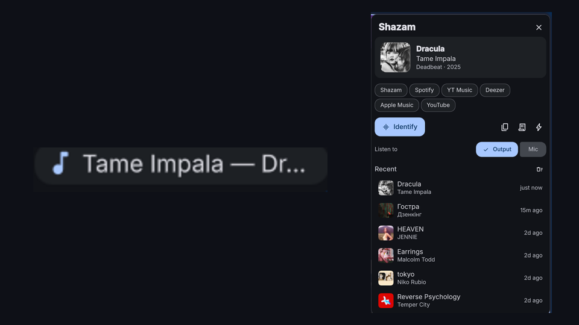

# Shazam

Song recognition in the DankBar, powered by [SongRec](https://github.com/marin-m/SongRec).



## Requires

- `songrec` on `$PATH` (`sudo pacman -S songrec` on Arch)
- `parecord` and `pactl` (from `libpulse`, already there on a PipeWire setup)

## How the sampling works

SongRec's own live capture does not work against a PipeWire monitor source: it
samples for minutes without a single match on audio it recognizes instantly from
a file. So the plugin does the sampling itself — `parecord` records a 13 second
chunk from the chosen source, `songrec recognize --json` identifies the file, and
that repeats until the listening budget runs out. A hit is reported the moment it
happens.

## Use it

- **Left click** the pill — opens the panel and (by default) starts listening.
- **Right click** the pill — starts or stops listening without opening anything.
- **Panel** — cover art, title, artist, album and year; one chip per service
  Shazam knows about for the track (Shazam, Spotify, YouTube Music, Deezer,
  Apple Music, plus a YouTube search); a copy button for "Artist — Title" and a
  second one for the full details (album, year, genre, ISRC, link); and a
  source switch, so output/mic can be changed without opening settings. Recent
  matches are listed below; click one to open it, right click to copy it.
- **Custom action** — set a command in the settings and a button appears in the
  panel. Nothing ships by default. The track is passed as arguments rather than
  spliced into the command: `$1` artist, `$2` title, `$3` album, `$4` Shazam
  URL, `$5` "artist title". For example
  `printf '%s\n' "$5" >> ~/Music/wishlist.txt`.
- **Keybind** — `dms ipc call shazam identify` (also `stop`, `toggle`, `state`,
  `last`), e.g. in Hyprland:

  ```
  bind = SUPER, S, exec, dms ipc call shazam identify
  ```

## What it listens to

By default: **system output**. Each run resolves `pactl get-default-sink` and
records that sink's `.monitor` source, so it follows your output device when you
switch headphones or speakers — and it hears what the machine is playing, not
the room.

Switch **Listen to** in the settings to **Microphone** for the room instead, or
to **Specific device** plus an **Audio device** name from `songrec recognize -l`
to pin one source.

## Notes

- Recognition runs in a daemon surface, so a multi-monitor setup shares one
  `songrec` process and one result across every bar.
- A run is wrapped in `timeout` — SongRec would otherwise keep sampling the
  microphone forever when nothing matches.
- History is kept in the plugin state file, not in your settings.
